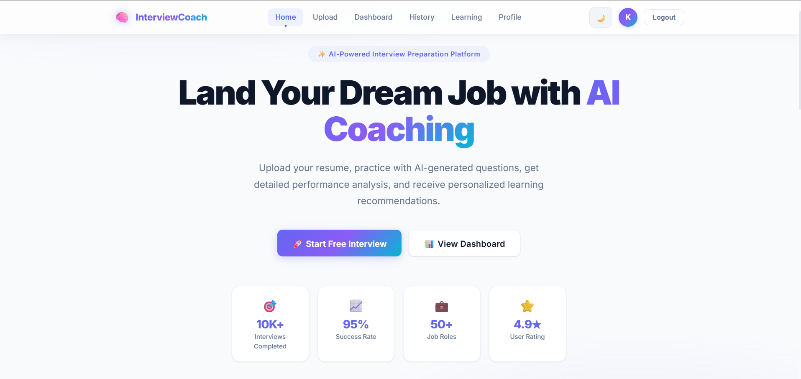
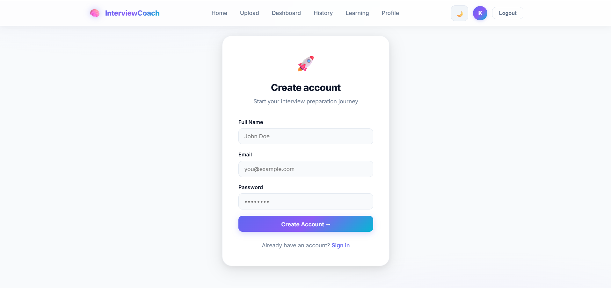
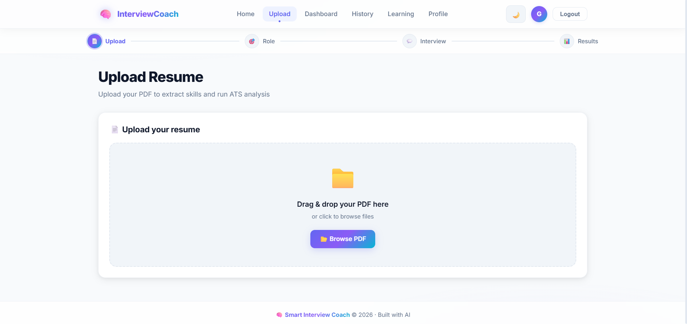
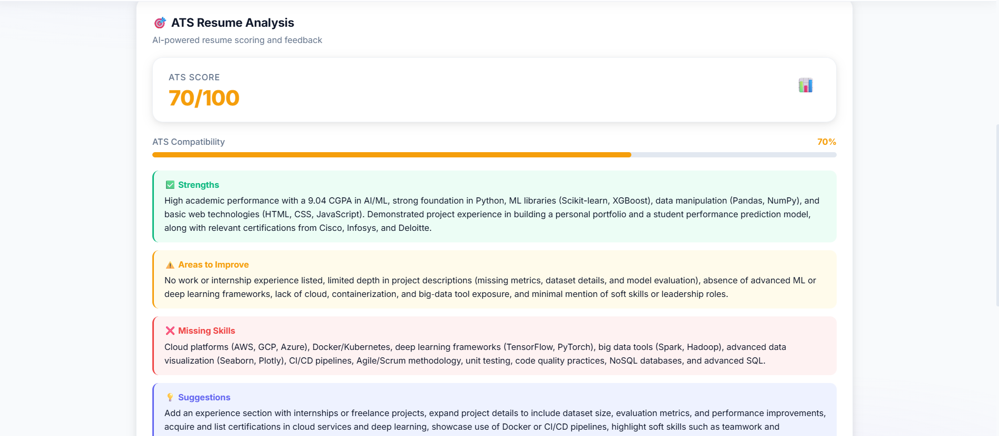
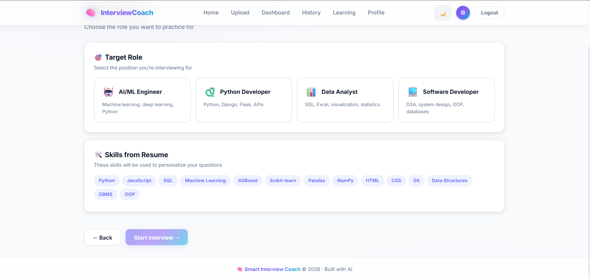
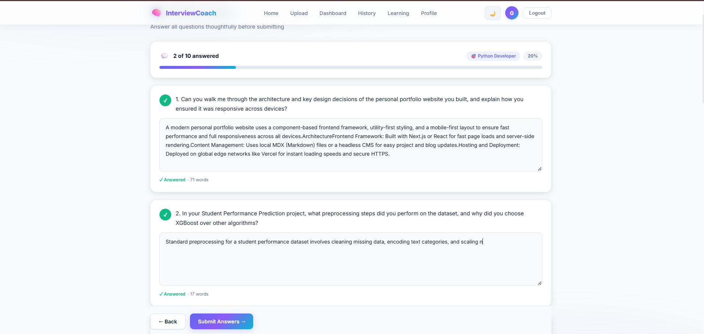
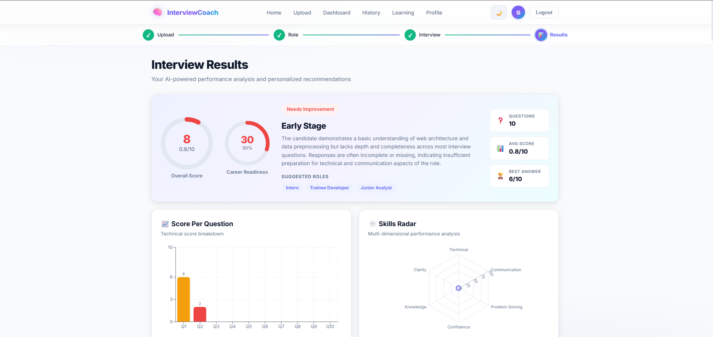
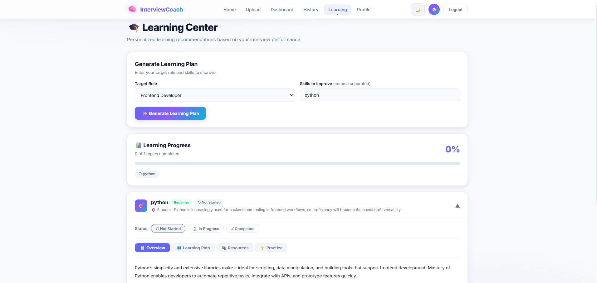
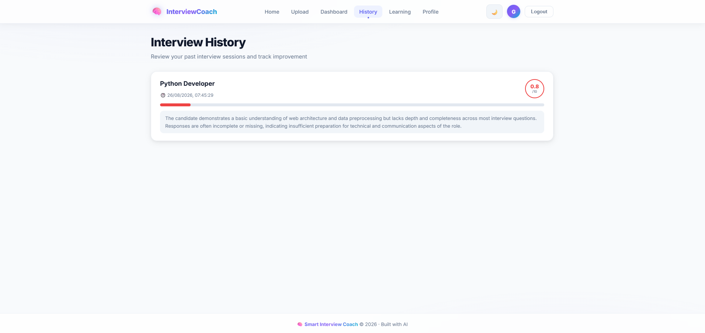
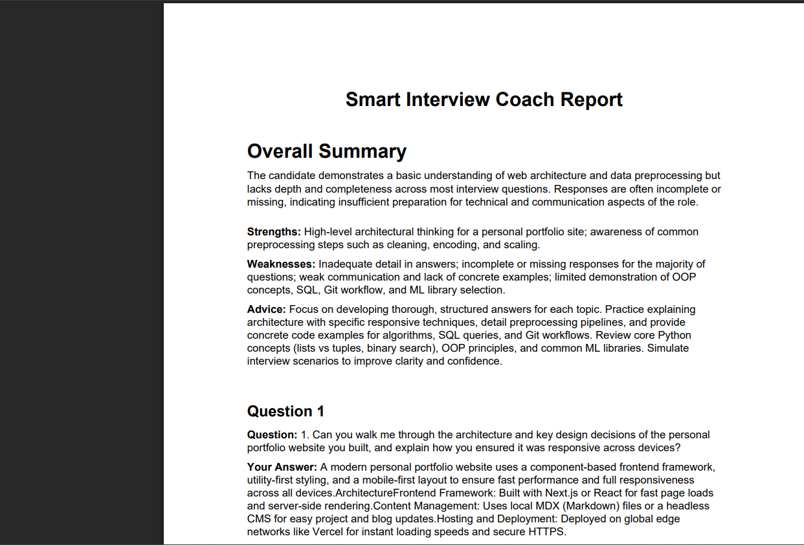

# 🎯 Smart Interview Coach

An AI-powered mock interview platform that helps candidates prepare for technical interviews using resume analysis, AI-generated interview questions, interactive mock interviews, AI-powered evaluation, and personalized learning recommendations.

## 🚀 Live Demo

👉 **[Try Smart Interview Coach](https://smart-interview-coach-final-p8a2r4pgl-venkatesh5.vercel.app/)**

## ✨ Features

- 📄 Resume upload and analysis
- 🧠 Skill extraction from resumes
- 🎯 Role-based interview preparation
- 🤖 AI-generated interview questions
- 🎤 Interactive mock interviews
- 📊 AI-powered answer evaluation
- ⭐ Technical and communication scoring
- 💡 Strengths and improvement feedback
- 📚 Personalized learning recommendations
- ❓ Practice questions
- 💻 Coding questions
- 📜 Interview history
- 🔐 User authentication
- 🔑 Google authentication
- 📱 Responsive React UI

---

# 📸 Application Screenshots

## 🏠 Landing Page



## 🔐 Login



## 📄 Resume Upload



## 📊 ATS Resume Analysis



## 🎯 Role Selection



## 🎤 Mock Interview



## 📋 Interview Evaluation



## 📚 Personalized Learning



## 📜 Interview History



## 📥 Download Summary



---


# 📸 Application Screenshots

## 🏠 Landing Page


## 🔐 Login


## 📄 Resume Upload


## 📊 ATS Resume Analysis


## 🎯 Role Selection


## 🎤 Mock Interview


## 📋 Interview Evaluation


## 📚 Personalized Learning


## 📜 Interview History


## 📥 Download Summary


---


# 🏗️ System Architecture

```text
                    ┌──────────────────────┐
                    │    React + Vite      │
                    │      Frontend        │
                    └──────────┬───────────┘
                               │
                               │ REST API
                               ▼
                    ┌──────────────────────┐
                    │    Flask Backend     │
                    │       APIs           │
                    └──────────┬───────────┘
                               │
              ┌────────────────┼────────────────┐
              │                │                │
              ▼                ▼                ▼
       ┌────────────┐   ┌──────────────┐  ┌─────────────┐
       │   Resume   │   │   Groq AI    │  │   SQLite    │
       │ Processing │   │   Service    │  │  Database   │
       └────────────┘   └──────────────┘  └─────────────┘
              │                │
              ▼                ▼
       Skill Extraction   Question Generation
       Resume Analysis    Answer Evaluation
                          Learning Recommendations


🔄 Application Workflow

User
  │
  ▼
Register / Login
  │
  ▼
Upload Resume
  │
  ▼
Resume Processing
  │
  ├──► Resume Analysis
  │
  └──► Skill Extraction
          │
          ▼
    Select Interview Role
          │
          ▼
 AI-Generated Questions
          │
          ▼
      Mock Interview
          │
          ▼
      Submit Answers
          │
          ▼
    AI Answer Evaluation
          │
          ▼
    Performance Analysis
          │
          ├──► Technical Score
          ├──► Communication Score
          ├──► Strengths
          ├──► Mistakes
          ├──► Improved Answers
          └──► Recommendations
          │
          ▼
 Interview History
          │
          ▼
Learning Recommendations


🛠️ Tech Stack
Frontend
React
Vite
JavaScript
React Router
Recharts
HTML
CSS
Backend
Python
Flask
Flask-CORS
Flask-JWT-Extended
REST APIs
Gunicorn
AI
Groq API
LLM-powered question generation
AI answer evaluation
Personalized learning recommendations
Resume Processing
PyPDF2
pdfplumber
Database
SQLite
Authentication
JWT Authentication
Google Authentication
Deployment
Frontend: Vercel
Backend: Render


📚 Personalized Learning Recommendation

After an interview, the system analyzes the candidate's weaknesses and generates targeted learning content.

The recommendation system provides:

Skill or topic
Difficulty level
Estimated learning time
Reason for recommendation
Topic summary
Key concepts
Learning path
YouTube learning topics
Udemy learning topics
Practice questions
Coding questions


Learning Pipeline

Interview
    ↓
AI Evaluation
    ↓
Weakness Identification
    ↓
Learning Recommendation
    ↓
Learning Path
    ↓
Practice Questions
    ↓
Coding Practice
    ↓
Better Interview Preparation

🧠 AI Pipeline

Resume
   ↓
Resume Text Extraction
   ↓
Skill Extraction
   ↓
Role Selection
   ↓
Personalized Question Generation
   ↓
Candidate Answers
   ↓
AI Evaluation
   ↓
Technical & Communication Scores
   ↓
Strengths & Mistakes
   ↓
Personalized Learning Recommendations

📂 Project Structure

smart-interview-coach/
│
├── backend/
│   ├── data/
│   ├── routes/
│   ├── services/
│   ├── app.py
│   ├── database.py
│   └── requirements.txt
│
├── frontend/
│   ├── public/
│   ├── src/
│   ├── package.json
│   ├── package-lock.json
│   └── vite.config.js
│
├── screenshots/
│   ├── landing-page.png
│   ├── login.png
│   ├── resume-upload.png
│   ├── ats-analysis.png
│   ├── role-selection.png
│   ├── mock-interview.png
│   ├── evaluation-answers.png
│   ├── learning.png
│   ├── history.png
│   └── download-summary.png
│
├── .gitignore
└── README.md

⚙️ Local Installation

Prerequisites
Python 3.10+
Node.js
npm
Git

1. Clone Repository

git clone https://github.com/VenkateshRachapothu/smart-interview-coach-final.git
cd smart-interview-coach-final


2. Backend Setup

cd backend
python -m venv venv

Windows

venv\Scripts\activate

Install dependencies:

pip install -r requirements.txt

Create:

backend/.env

Add:

GROQ_API_KEY=your_groq_api_key
JWT_SECRET_KEY=your_secret_key

Start backend:

python app.py

3. Frontend Setup

Open another terminal:

cd frontend
npm install

Create:

frontend/.env

Add:

VITE_API_URL=http://127.0.0.1:5000

Start frontend:

npm run dev

🔐 Security

Sensitive information is excluded from GitHub.

The project uses:

Environment variables for API keys
.gitignore for .env files
JWT authentication
Protected API endpoints
Excluded virtual environments
Excluded node_modules
Excluded uploaded resume files
Excluded local database files

Never commit API keys, passwords, .env files, or other secrets to GitHub.


## 🌐 Deployment

### Frontend

Deployed using Vercel.

👉 **[Live Application](https://smart-interview-coach-final-p8a2r4pgl-venkatesh5.vercel.app/)**

### Backend

The Flask backend is deployed as a web service using Render.

👉 **[Backend API](https://smart-interview-coach-final-backend.onrender.com/)**


AI Service

Groq API is used for:

Interview question generation
Answer evaluation
Personalized learning recommendations
🚧 Future Improvements
🎙️ Voice-based mock interviews
🗣️ Speech-to-text interaction
📈 Advanced interview analytics
🎯 Interview difficulty levels
💼 More job roles
📚 Advanced learning progress tracking
🧠 Personalized interview preparation plans
🔌 Additional LLM providers
☁️ Cloud database integration
⚡ Real-time interview feedback
👨‍💻 Contributors
Venkatesh Rachapothu
Dinesh Katreddi

This project was developed as a collaborative academic and portfolio project.

📄 License

This project is intended for educational and portfolio purposes.